  

<!--
profile.json を編集してから、SVGを再生成してください:

python3 scripts/generate_terminal.py

配色は普段使っている WezTerm / Starship / Kanagawa Dragon の設定
(nix-config リポジトリ) から抽出しています。
-->

## 研究

- **Human-Computable Passwords** — 人間が計算可能な認証方式のベンチマーク研究
  - ルール実行（演繹）とルール逆推定（帰納）の両面から LLM の限界を評価
  - [Naruto-Takahashi/human-computable-passwords](https://github.com/Naruto-Takahashi/human-computable-passwords)

## スキル・関心

- **Python** — 機械学習・研究用途
- **Rust** — 低レイヤ・高速性への関心からインプット中
- **環境構築** — Nix / Home Manager による宣言的システム管理，ghq によるリポジトリ一元管理

## 開発環境

- WSL2 (Windows 11) / macOS (Apple Silicon) / NixOS
- Neovim + WezTerm
- komorebi + YASB (Windows) / Hyprland (NixOS) / AeroSpace (Mac)
